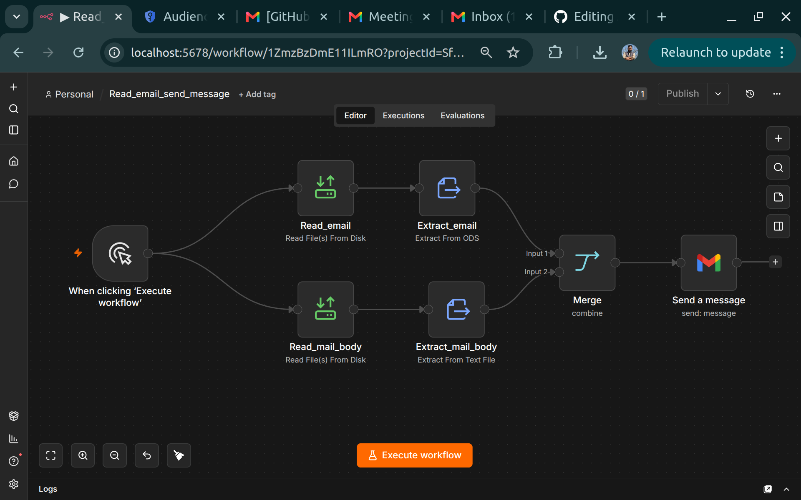

# 📢📢 Attention Please 📢📢
## New Assignment has beed added in "Tasks" folder
## See in "Tasks/Assignment_2" file


[Lecture 1](https://malikabdulsalam.github.io/AI_Automation/1-AI_Automation.html)

[Lecture 2 : n8n local setup](https://malikabdulsalam.github.io/AI_Automation/3-n8n_local_setup.html)

[Lecture 3 : send email to list of items using local files ](https://malikabdulsalam.github.io/AI_Automation/3-n8n_email_automation_on_local_data.html)


# 🤖 Introduction to AI Automation

Artificial Intelligence (AI) Automation is the use of AI technologies to perform tasks and processes automatically with minimal human intervention. It combines AI models, workflows, and software systems to create intelligent systems that can make decisions, process data, and execute actions on their own.

In simple words, AI automation allows machines and software to think, analyze, and act like humans in repetitive or decision-based tasks.

---

## 🚀 Why AI Automation is Important

- Saves time by reducing manual work  
- Increases efficiency and productivity  
- Reduces human errors  
- Enables 24/7 intelligent operations  
- Helps businesses scale faster  

---

## 🧠 Where AI Automation is Used

- Industrial automation (factories, robotics)  
- Chatbots and virtual assistants  
- Data analysis and reporting  
- Computer vision systems (object detection, surveillance)  
- Workflow automation tools (n8n, Zapier, Make)  

---

## ⚙️ Example of AI Automation

A smart factory can automatically:
- Detect defective products using computer vision  
- Stop machines when an error is detected  
- Generate production reports  
- Send alerts to engineers  

All without human involvement in real-time decisions.

---

## 🌍 Future of AI Automation

AI automation is rapidly growing and will become a core part of every industry. From healthcare to manufacturing and business operations, AI will handle most repetitive and intelligent decision-making tasks in the future.

---

## 🎯 Conclusion

AI Automation is not just a technology — it is the future of how industries will operate. Learning AI automation opens doors to careers in AI engineering, robotics, data science, and industrial AI systems.

# 🚀 Local Setup of n8n (Complete Guide)

## 🎯 Objective

In this guide, we will install and run n8n workflow automation platform locally using Docker. After this setup, you will be able to:

- Run n8n on your own computer
- Create workflows locally
- Connect files, APIs, and automation tools

---

## 🧠 1. What is n8n?

n8n is a powerful workflow automation tool that allows you to connect apps, APIs, and services visually without heavy coding.

- Open-source automation tool
- Self-hosted (run locally or on server)
- Supports 400+ integrations

---

## ⚙️ 2. Requirements

- Linux / Windows / Mac
- Docker installed
- At least 2GB RAM
- Basic terminal knowledge

> **⚠️ Docker is required for easiest installation.**

---

## 🐳 3. Install Docker (If not installed)

```bash
sudo apt update
sudo apt install docker.io -y
sudo systemctl start docker
sudo systemctl enable docker
```

**Check version:**

```bash
docker --version
```

---

## 📦 4. Create Required Folders

```bash
mkdir -p /home/your-user/n8n_data
mkdir -p /home/your-user/n8n_files
```

**Fix permissions:**

```bash
sudo chown -R 1000:1000 /home/your-user/n8n_data
```

---

## 🚀 5. Run n8n Using Docker

```bash
docker run -d \
  --name n8n-main \
  --restart always \
  -p 5678:5678 \
  -e N8N_SECURE_FILE_ACCESS_MODE=false \
  -e N8N_LOCAL_FILES_BASE_DIR=/files \
  -v /home/your-user/n8n_files:/files \
  -v /home/your-user/n8n_data:/home/node/.n8n \
  n8nio/n8n
```

---

## 🌐 6. Open n8n in Browser

After running container, open:

```
http://localhost:5678
```

You will see the n8n editor interface.

---

## 📂 7. File Access in n8n

n8n does **NOT** allow random file access for security.

**Allowed folder is:**

```
/home/node/.n8n-files
```

**To use your own files:**

```bash
docker run -v /your/path:/files
```

Then inside n8n use:

```
/files/yourfile.ods
```

---

## ⚠️ 8. Common Issues

| Issue | Solution |
|-------|----------|
| ❌ Permission denied | Fix with `chown 1000:1000` |
| ❌ File not found | Wrong volume mount path |
| ❌ Container restart loop | Check logs with `docker logs` |

---

## 🔍 9. Check if n8n is Running

```bash
docker ps
```

**Check logs:**

```bash
docker logs n8n-main
```

---

## 🔁 10. Restart n8n

```bash
docker start n8n-main
```

**Stop:**

```bash
docker stop n8n-main
```

---

## 💡 11. Final Architecture

```
Local Folder (/n8n_files)
        ↓
Docker Volume Mount
        ↓
n8n Container
        ↓
Workflow Automation
        ↓
APIs / Gmail / Files / AI
```

---


## 📝 Quick Commands Reference

| Command | Description |
|---------|-------------|
| `docker run -d --name n8n-main ...` | Run n8n container in background |
| `docker ps` | List running containers |
| `docker logs n8n-main` | View n8n logs |
| `docker stop n8n-main` | Stop n8n container |
| `docker start n8n-main` | Start n8n container |
| `docker rm n8n-main` | Remove n8n container |

---

---
=======================================================================================
---

## 🚀 Starting a Workflow (Triggers)

| Node | What it Does |
|------|--------------|
| **Schedule Trigger** | Runs workflows automatically on a schedule. |
| **Event Triggers** | Starts workflows in response to events in other apps or services. |
| **Webhook** | Starts workflows instantly by receiving data from external apps via HTTP calls. |
| **Email Trigger (IMAP)** | Starts a workflow based on new incoming emails, automate responses or parse info. |
| **RSS Feed Trigger** | Monitors RSS/Atom feeds and triggers when a new item is published. |

---

## 🔄 Processing & Managing Data

| Node | What it Does |
|------|--------------|
| **Split Out** | Takes a list of items and splits it into separate items to be processed one by one. |
| **Aggregate** | Takes multiple items and combines them into a single item. |
| **Edit Fields (Set)** | The primary tool for cleaning, formatting, and transforming data as it passes through. |
| **IF Node** | Adds simple "yes/no" conditional logic, sending data down different paths. |
| **Switch Node** | Routes data based on multiple conditions, like a more powerful IF node. |
| **Code Node** | For ultimate control: custom JavaScript (or Python) for complex logic and data transformations. |
| **Loop Node** | Repeats a section of your workflow until a condition is met. |
| **Merge** | Combines data from two or more separate branches into a single stream. |
| **Filter** | A simpler alternative to IF: allows data to pass only if it meets conditions. |
| **Split In Batches** | Processes a large list of items in smaller, manageable batches (prevents timeouts). |
| **Crypto** | Performs cryptographic operations like hashing, encryption / decryption. |
| **Date & Time** | Formats, adds, or subtracts time from dates. Essential for dynamic date logic. |
| **HTML Extract** | Pulls specific pieces of data out of raw HTML — perfect for web scraping. |
| **Spreadsheet File** | Reads from and writes to spreadsheet files (.xlsx, .csv). |
| **Execute Command** | Runs system commands on the server where n8n is hosted. |

---

## 🌍 Connecting to the World (Integrations & APIs)

| Node | What it Does |
|------|--------------|
| **HTTP Request** | The "Universal Connector" — makes calls to any REST API. |
| **Google Sheets** | Powerful node for reading from and writing to Google Sheets. |
| **Slack** | Sends messages, creates channels, interacts with Slack workspace. |
| **Gmail** | Sends emails, reads/replies to threads, manages inbox. |
| **Telegram / Discord** | Sends messages and notifications via these popular platforms. |
| **Notion** | Creates, updates, and queries pages in a Notion database. |
| **Airtable** | Creates, reads, and updates records in an Airtable base. |
| **PostgreSQL / MySQL** | Connects to popular relational databases to query, insert, and update. |
| **MongoDB** | Connect and work with MongoDB, a popular NoSQL database. |
| **GitHub** | Interacts with GitHub: manage repos, issues, and pull requests. |
| **Salesforce / HubSpot** | Key nodes for CRM & marketing platform automation. |
| **Email Send** | Sends emails directly from your workflow. |

---

## 🧠 AI & Advanced Capabilities

| Node | What it Does |
|------|--------------|
| **AI Agent** | Leverages an AI model to make decisions and take actions. |
| **AI Tools** | Nodes that provide AI functionality like text generation or analysis. |
| **Structured Output Parser** | Ensures output from an AI agent follows a specific, structured format (e.g., JSON). |
| **OpenAI / Claude / Gemini** | Individual nodes for major LLM providers (OpenAI, Anthropic, Google). |
| **Vector Store** | Used with AI Agents to create a memory or knowledge base for retrieval. |
| **Subworkflows** | Calls another workflow to run separately, making complex workflows more manageable. |
| **Respond to Webhook** | Sends a response back to the app that triggered the webhook. |

---

## 🧩 Popular Community Nodes (Top Downloads)

| Node | Description | Monthly Downloads |
|------|-------------|-------------------|
| **n8n-nodes-evolution-api** | Multi-channel hub focused on WhatsApp automation. | 638k – 961k |
| **n8n-nodes-chatwoot** | Integrates the ChatWoot platform into workflows. | 32k – 324k |
| **n8n-nodes-globals** | Manages global constants for use across workflows. | ~18k |
| **n8n-nodes-text-manipulation** | Performs text manipulations: formatting, extraction, etc. | 12k – 10k |
| **n8n-nodes-turndown-html-to-markdown** | Converts HTML content into Markdown format. | ~46k |
| **n8n-nodes-puppeteer / Playwright** | Browser automation for testing & web scraping. | 9k – 4.8k |
| **n8n-nodes-firecrawl / Scrapeninja** | Web scraping APIs to extract data from websites. | 5k – 1.4k |
| **n8n-nodes-document-generator** | Generates dynamic documents or emails using templates (Handlebars). | 8k – 33k |

---

=====================================================================================
---
# Projects

## 🎯 Send E-mail to list of excel file 
Email is writtent in text file and mail list is in excel file of your local Computer




## 🎯 Content creation for facebook and uploading workflow 
workflow to creat facebook content for marketing and auto upload on daily basis

working on this ....

